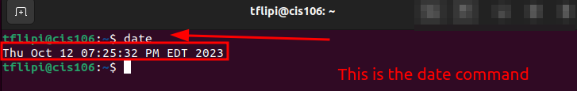
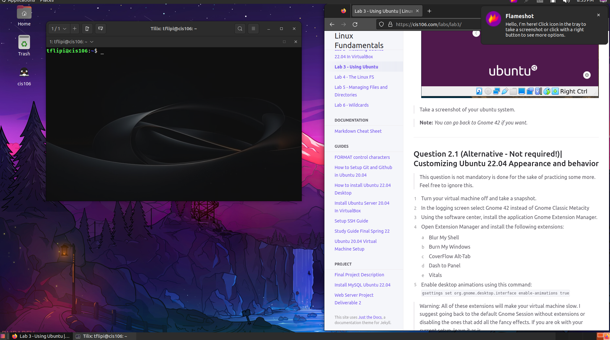
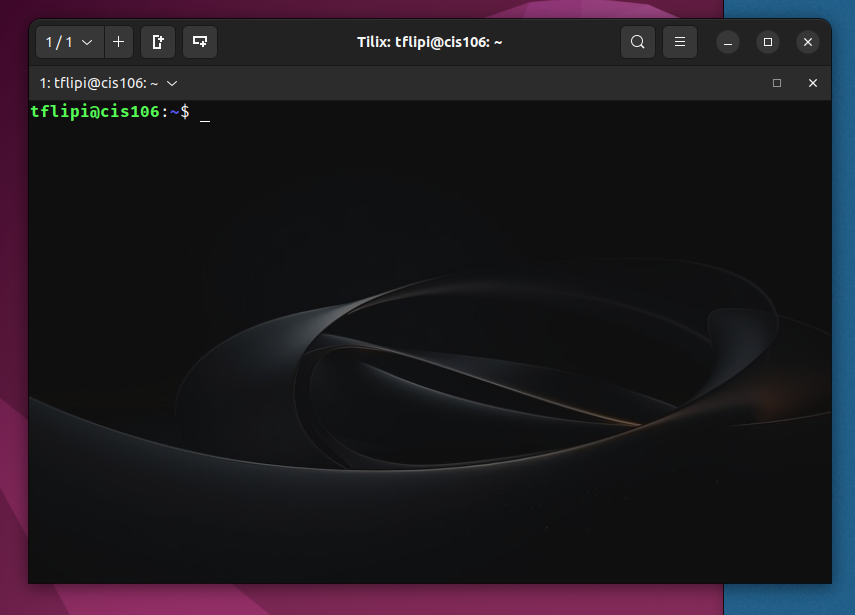

# Lab 3 Submission

## Question 1

## Question 2

## Question 3

| Program purpose     | Package Name     | Version            |
| ------------------- | ---------------- | ------------------ |
| Play a tetris game  | blockattack      | 2.7.0-1            |
| Play a video file   | dragonplayer     | 4:21.12.3-0ubuntu1 |
| Browse the Internet | epiphany-browser | 42.4-0ubuntu1      |
| Read your email     | geary            | 40.0-2             |
| Play Music          | mpc              | 0.34-1             |

## Question 4

| command | what it does                                                                     |
| ------- | -------------------------------------------------------------------------------- |
| echo    | echo the string(s) to standard output                                            |
| fortune | Print a random, hopefully interesting, adage                                     |
| cowsay  | Cowsay generates an ASCII picture if a cow saying something provided by the user |
| lolcat  | Rainbow coloring effect for text console display                                 |
| figlet  | Display large characters made up of ordinary screen characters                   |
| toilet  | Display large colorful characters                                                |
| rig     | Random identity generator                                                        |
| boxes   | text mode box and comment drawing filter                                         |